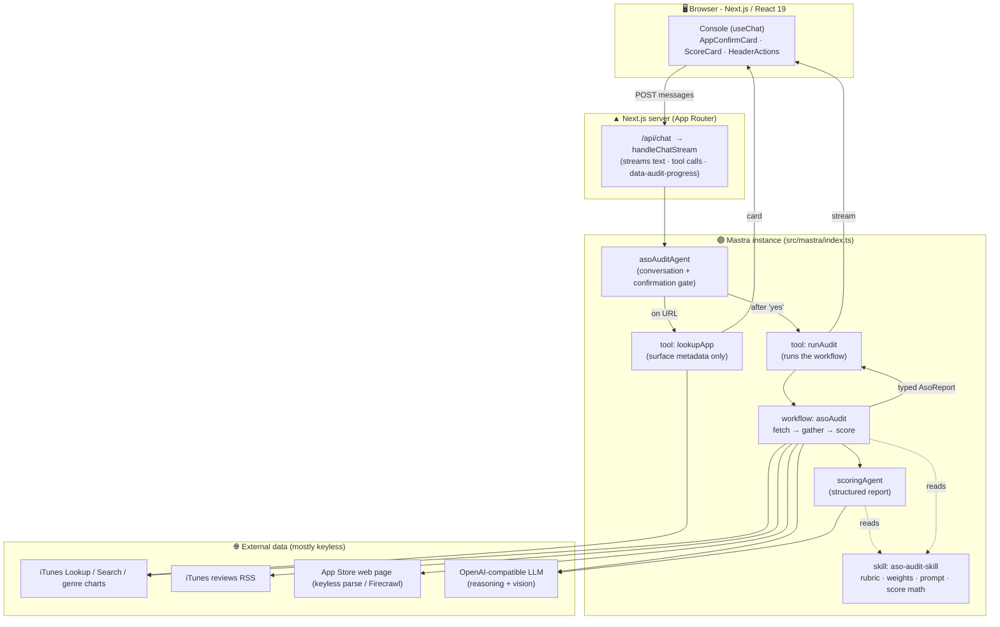
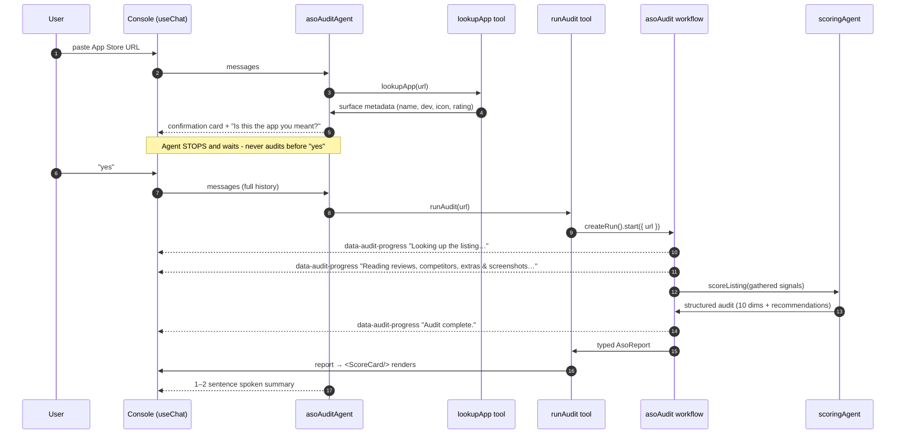
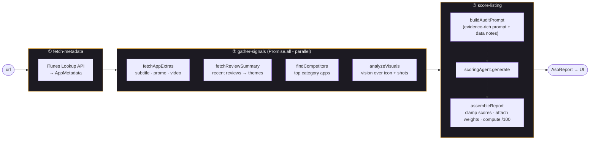

# ASO Audit Agent

> Paste an Apple App Store URL → confirm the app → get a comprehensive, evidence-cited
> **App Store Optimization (ASO)** audit with a prioritized, copy-pasteable action plan.

A TypeScript chat application that audits any Apple App Store listing across **10 weighted
ASO dimensions** and renders a polished scorecard with quick wins, high-impact changes,
strategic recommendations, and a competitor comparison - every finding tied to a real data
point pulled from live Apple APIs.

Built on **[Mastra](https://mastra.ai)** - idiomatic use of **agents**, **tools**,
**workflows**, and a reusable **skill** - with a hand-built **Next.js** front end.


-76b900)


---

## Table of contents

- [What it does](#what-it-does)
- [Why it's built this way](#why-its-built-this-way)
- [Architecture](#architecture)
- [End-to-end workflow](#end-to-end-workflow)
- [The audit pipeline (workflow internals)](#the-audit-pipeline-workflow-internals)
- [The scoring model](#the-scoring-model)
- [Data sources](#data-sources)
- [Quick start](#quick-start)
- [Configuration](#configuration)
- [Project layout](#project-layout)
- [Testing](#testing)
- [Design decisions](#design-decisions)
- [Limitations & honesty about data gaps](#limitations--honesty-about-data-gaps)

---

## What it does

1. **Paste** an App Store URL into the chat
   (e.g. `https://apps.apple.com/us/app/spotify-music-and-podcasts/id324684580`).
2. The agent fetches **surface metadata** (name, developer, icon, category, rating) and shows a
   **confirmation card** - *"Is this the app you meant?"* - then **stops and waits**.
3. On your **"yes"**, it runs the **full audit**: gathering reviews, competitors, listing extras,
   and a vision read of the screenshots/icon, then scoring the listing with an LLM.
4. While it runs, the chat **streams live progress**; when it finishes, a rich **scorecard**
   renders in the canvas: an overall score out of 100, per-dimension bars with evidence, and
   three tiers of recommendations with **before/after rewrites** plus a competitor table.

### Highlights

- 🎯 **10-dimension weighted rubric** (Title, Subtitle, Keyword field, Description, Screenshots,
  App-preview video, Ratings & reviews, Icon, Conversion signals, Competitive position).
- 🔎 **Every score is evidence-cited** - actual character counts, ratings, review themes,
  competitor gaps - and text recommendations include concrete **before → after** examples.
- 👁️ **Vision analysis** of the real icon + first screenshots (OCR-able text, value, cohesion),
  with graceful fallback to metadata heuristics when no vision model is available.
- 🆓 **Keyless by default** - primary data comes from Apple's free JSON/RSS APIs; the three fields
  those APIs lack (subtitle, promo text, video) come from a small keyless web parse.
- 🔌 **Provider-agnostic** - one env switch moves the whole app between NVIDIA NIM, OpenAI,
  Together, Groq, Ollama, etc. (anything OpenAI-compatible).
- 🛡️ **Honest about what it can't see** - genuine data gaps surface as *"Data notes"* instead of
  being fabricated around.

---

## Why it's built this way

The brief asked for **idiomatic Mastra** and a result that's *"actually nice to look at."* The
shape below maps each concern to the Mastra primitive that fits it best:

| Concern | Primitive | Why |
|---|---|---|
| Turn-taking conversation + the confirmation gate | **Agent** (`asoAuditAgent`) | Natural language, deciding when to call which tool - what an LLM agent is good at. |
| Deterministic audit orchestration | **Workflow** (`asoAudit`) | Fixed steps, parallel fan-out, typed I/O, per-step progress - what a workflow is good at. |
| Producing the structured report | **Agent** (`scoringAgent`) | A tool-less generation agent the workflow calls, isolated from the chat. |
| The rubric, weights, prompt & score math | **Skill** (`aso-audit-skill.ts`) | One source of truth both agents read from. |
| Cheap "what app is this?" lookup vs. the full run | **Tools** (`lookupApp`, `runAudit`) | Two clearly-scoped tools the agent chooses between. |

---

## Architecture



**Reading it:** the **agent** owns the chat and decides *when* to call each tool. `lookupApp` is a
cheap, LLM-free metadata fetch that powers the confirmation card. Only after the user confirms does
the agent call `runAudit`, which executes the deterministic **workflow**. The workflow gathers
signals in parallel and hands them to the **scoring agent**; both it and the workflow read the
**skill** for the rubric and score math. The typed `AsoReport` streams back to the UI to render.

---

## End-to-end workflow



The confirmation gate is **instruction-enforced** in the agent prompt (it must look up, present,
and wait - never audit in the same turn). No server-side memory is needed: `useChat` resends the
full history each turn, so the agent always has the prior confirmation context.

---

## The audit pipeline (workflow internals)

`asoAudit` is three deterministic, typed steps. Step 2 fans out to four independent sources in
parallel, so the audit's wall-clock is bounded by the slowest single source, not their sum.



| Step | ID | Input → Output | What it does |
|---|---|---|---|
| ① | `fetch-metadata` | `{ url }` → `AppMetadata` | Resolves the URL to an app id + storefront and pulls Apple's JSON metadata. |
| ② | `gather-signals` | `AppMetadata` → gathered signals | **Parallel** fetch of extras, reviews, competitors, and a vision read. A source that fails degrades gracefully (its gap is noted, the audit continues). |
| ③ | `score-listing` | gathered → `AsoReport` | Builds one evidence-rich prompt, runs the scoring agent, and assembles the strict, typed report. |

Each step emits a `data-audit-progress` chunk; `runAudit` also derives progress from the workflow's
step-lifecycle events and forwards serialized writes to the chat stream.

---

## The scoring model

The rubric lives in **`src/mastra/skills/aso-audit-skill.ts`** as the single source of truth.

| Dimension | Weight | Key checks (abridged) |
|---|---:|---|
| **Title** (30 char) | 20% | Primary keyword? Char utilization? Brand vs. keyword balance? Natural, not stuffed? |
| **Subtitle** (30 char) | 15% | Distinct secondary keywords? Benefit-driven? Full utilization? |
| **Keyword field** (100 char) | 15% | Inferred (never public). No dupes? Singular forms? No wasted words? |
| **Description** | 10% | First 3 lines hook above "more"? Benefit-framed? Social proof? CTA? |
| **Screenshots** | 15% | All 10 slots? First 2–3 sell value? OCR-able text? Cohesive design? |
| **App preview video** | 5% | Present? (presence detectable; content not). |
| **Ratings & reviews** | 15% | Avg rating? Recent trend? Praise/complaint themes? |
| **Icon** | 5% | Distinctive? Clear when small? Category-appropriate? |
| **Conversion signals** | 5% | Promo text? "What's New" informative? In-App Events? |
| **Competitive position** | 5% | Keyword/visual/rating gap vs. top 3 category competitors? |

**Weights sum to 110%**, so the overall score is computed as a **weight-normalized average** of the
0–10 dimension scores scaled to 0–100 - a true score out of 100 regardless of the weight total
(`computeOverallScore`).

**Lenient in, strict out.** The LLM only has to return a `{ score, evidence, notes }` per dimension
plus the recommendation lists (a small, forgiving JSON shape). Weights, labels, clamping, key
canonicalization, and the overall score are all attached **in code** (`score.ts → assembleReport`),
then validated against the strict `asoReportSchema` the UI consumes. This keeps scoring reliable even
on models with weaker structured-output support - with a single corrective retry if the first reply
isn't valid JSON.

---

## Data sources

All free; no scraping required for most of it.

| Source | Keyless? | Provides |
|---|:--:|---|
| iTunes **Lookup API** | ✅ | name, developer, icon, category, description, "What's New", screenshots, ratings, version |
| iTunes **reviews RSS** | ✅ | recent reviews (rating + text) → trend & themes |
| iTunes **Search / genre charts** | ✅ | top category competitors, enriched with ratings |
| App Store **web page** | ✅ | subtitle + preview-video presence (promo text too, when set) via a small keyless parse |
| **Firecrawl** (optional) | key | a robustness upgrade for promotional-text extraction only |
| **Vision model** | key | reads the real icon + first screenshots (OCR-able text, value, cohesion) |

---

## Quick start

```bash
npm install
cp .env.example .env      # then fill in LLM_API_KEY (see Configuration)
npm run dev               # http://localhost:3000
```

Paste an App Store URL into the chat, e.g.
`https://apps.apple.com/us/app/spotify-music-and-podcasts/id324684580`, confirm the app, and
watch the audit run.

**Requirements:** Node ≥ 20. A free OpenAI-compatible key (NVIDIA NIM gives free credits at
<https://build.nvidia.com>).

---

## Configuration

Everything is OpenAI-compatible, so any provider works by changing the base URL + model ids.
**NVIDIA NIM** is the default.

| Variable | Required | Purpose |
|---|:--:|---|
| `LLM_API_KEY` | ✅ | Key for the OpenAI-compatible endpoint. |
| `LLM_BASE_URL` | – | Defaults to `https://integrate.api.nvidia.com/v1`. |
| `LLM_MODEL` | – | Reasoning/scoring model. Default `meta/llama-3.3-70b-instruct`. **Must support tool calling.** |
| `LLM_VISION_MODEL` | – | Vision model for screenshot/icon analysis. Default `meta/llama-3.2-90b-vision-instruct`. Falls back gracefully if unavailable. |
| `FIRECRAWL_API_KEY` | – | Optional. The keyless parser already extracts subtitle + preview-video; Firecrawl only hardens promo-text extraction. |

Switching to OpenAI, for example:

```env
LLM_BASE_URL=https://api.openai.com/v1
LLM_API_KEY=sk-...
LLM_MODEL=gpt-4o
LLM_VISION_MODEL=gpt-4o
```

---

## Project layout

```
src/
  app/
    page.tsx                  # split layout: chat + audit canvas
    layout.tsx · globals.css  # shell + design system
    api/chat/route.ts         # handleChatStream → useChat (streams progress)
  components/
    Console.tsx               # the chat + canvas client component (useChat)
    AppConfirmCard.tsx        # "is this the app you meant?" card
    ScoreCard.tsx             # animated scorecard, recommendations, competitor table
    HeaderActions.tsx
  mastra/
    index.ts                  # Mastra instance (agents + workflow registered)
    model.ts                  # provider-agnostic OpenAI-compatible model config
    runtime.ts                # undici timeout tuning for slow LLM calls
    schema.ts                 # zod contracts: metadata → gathered → report
    skills/
      aso-audit-skill.ts      # THE rubric + weights + prompt + score math
    agents/
      aso-audit-agent.ts      # conversational agent (the confirmation gate)
      scoring-agent.ts        # tool-less structured-report agent
    tools/
      lookup-app.ts           # cheap surface-metadata fetch (no LLM)
      run-audit.ts            # runs the asoAudit workflow, forwards progress
    workflows/
      audit-workflow.ts       # fetch → gather (parallel) → score
    services/                 # pure, testable units:
      itunes.ts  reviews.ts  competitors.ts  extras.ts
      vision.ts  score.ts  http.ts  url.ts
```

---

## Testing

```bash
npm run typecheck            # tsc --noEmit
npm test                     # hermetic unit tests (vitest)
npm run test:integration     # live: real Apple APIs + a mock LLM (no keys needed)
```

The integration suite exercises the whole **non-LLM path against live Apple endpoints**, and
verifies Mastra **model resolution**, **structured-output scoring**, and the full **`runAudit` →
workflow** pipeline against a **mock OpenAI-compatible server** - so the deterministic machinery is
proven end-to-end without burning provider credits.

---

## Design decisions

These are the calls the brief explicitly left open.

- **Apple's free JSON API is primary, not scraping.** iTunes Lookup + RSS + Search cover most of the
  rubric reliably for any app. The three fields they lack (subtitle, promo text, video) come from a
  small **keyless** parse of the App Store web page; **Firecrawl is an optional upgrade**, never a
  requirement.
- **Custom Next.js UI over the Mastra playground.** The brief wanted recommendations that are
  *"actually nice to look at,"* so a hand-built scorecard (animated bars, before/after rewrites,
  competitor table) beats markdown in a generic chat.
- **Agent for conversation, workflow for the audit.** The confirmation is natural turn-taking; the
  audit is deterministic orchestration. The gate is instruction-enforced - it could be hardened with
  Mastra's `requireApproval` for a stricter click-to-approve flow.
- **Lenient model schema, strict UI schema.** The model returns a small, forgiving shape; weights,
  labels, clamping, and the overall score are computed in code and validated with zod. Reliable
  across models that struggle with large strict JSON schemas.
- **Weights are normalized.** They sum to 110%, so the overall score is a weight-normalized average
  scaled to 0–100 - a true /100 regardless of the weight total.
- **Provider-agnostic via OpenAI-compatible.** One env switch moves between NIM, OpenAI, etc. Vision
  degrades gracefully, so a non-vision model still produces a full audit.

---

## Limitations & honesty about data gaps

The audit is deliberate about what it **can't** see, and never fabricates around it:

- The **100-char keyword field is never public** - the model infers candidate keywords from the
  title/subtitle/description (as real ASO practitioners do) and says so.
- **Preview-video content** can't be analyzed (only presence is detectable).
- **Developer review-responses** aren't in the RSS feed.
- Genuine gaps (a page that failed to load, vision unavailable, no competitors retrieved) surface as
  **"Data notes"** in the report - *expected* findings (an app simply having no subtitle) are reported
  as recommendations, not caveats.
- **Tool-calling quality depends on the chosen model** - use a tool-calling-capable model for the
  chat agent (the defaults are).
- Free-tier rate limits / the 90B vision model can add latency; the audit fetches in parallel and
  completes with partial data (noted in the report) if a source is slow or fails.

---

Built with [Mastra](https://mastra.ai) · Next.js · React · TypeScript · zod.
