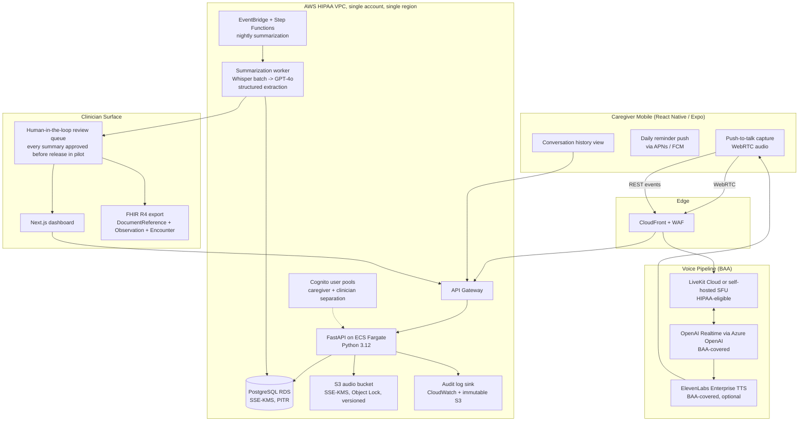

# Atenda MVP, Founding Engineer Response (App-first variant)

---

## Suggested email body (paste into reply to Christopher)

> Hi Christopher,
>
> Thanks, really enjoyed thinking through this. Rather than bullet points I put my approach into the attached doc, including an architecture sketch.
>
> Short version: I'd build the MVP the way the JD describes, **React Native app for caregivers, Next.js dashboard for clinicians, batch-summarized voice on a HIPAA-grade AWS backend**, and I think 12-14 weeks gets you 60 caregivers using it on real PHI without cutting compliance corners. The pieces I'd push back on are inside.
>
> Happy to walk through any of this, especially the hallucination story and the FHIR mapping, since those are the parts that most often go quietly wrong.
>
> Cheers,
> Fang

---

## Attached doc

# Atenda MVP, Founding Engineer Response

**From:** Fang Zhang
**To:** Christopher (Co-Founder & CCO, AtendaCare)
**Re:** Your nine questions

---

### A quick framing note

Christopher, thanks for skipping the resume theatre. I'll do the same and answer in plain language, with opinions. Every answer below assumes one principle: **the only thing that matters in the first 90 days is getting a clinically-pilotable loop into 60 caregivers' hands without ever putting PHI somewhere a BAA doesn't cover.** Everything else is a knob to tune.

I'm taking the JD's stack assumptions as load-bearing: a **mobile-first caregiver experience** (React Native via Expo) and a **web dashboard for clinicians** (Next.js), sitting on top of a HIPAA-eligible AWS backend. That choice shapes the timeline, the things I would and wouldn't build, and the risk picture below.

---

### 1. If I were founding engineer, what would the MVP architecture look like?

**One sentence:** A React Native app streams caregiver voice over WebRTC to a BAA-covered voice agent, encrypted audio + transcript land in AWS, a nightly batch pipeline produces FHIR-shaped clinical summaries, and a clinician reviews each one in a Next.js dashboard before it reaches the provider.

**Key choices and why:**

- **React Native via Expo** so we can ship to iOS and Android from one codebase, use OTA updates to push fixes without going through app review, and stand up a web build as a bonus. Native modules only where unavoidable.
- **WebRTC for live voice**, mediated by LiveKit (cloud or self-hosted), which is HIPAA-eligible under contract. This gives us the same low-latency voice loop the JD describes while keeping the media path inside BAA-covered infrastructure.
- **OpenAI Realtime via Azure OpenAI**, the Azure version gives us the BAA OpenAI's standard API does not for PHI. Single vendor for STT + LLM + TTS via Realtime collapses three integrations into one socket; if we want a more "human" voice we layer ElevenLabs Enterprise.
- **Modular monolith on FastAPI / ECS Fargate**, not microservices. One service, clean module boundaries. We're three months from product-market fit, not from scale problems.
- **Postgres for everything structured, S3 for audio**, no vector DB until we actually need RAG over prior conversations, pgvector first if so.
- **Nightly batch summarization, not real-time.** Clinical summaries are read weekly/biweekly. Synchronous summarization buys us nothing and burns money. Batch runs at 3 a.m., outputs land in a clinician review queue.
- **Human-in-the-loop on every summary for the pilot.** A clinician (or trained ops person) approves each before it goes to the provider. This is the only honest way to ship an LLM-generated clinical artifact under Enforcement Discretion in month one.
- **FHIR R4 as the export shape, not the storage shape.** Internally we store flat-ish Postgres tables; we render `DocumentReference` + `Observation` + `Encounter` resources at export time. Stops FHIR's data model from leaking into every CRUD path.
- **Single AWS account, single region, IaC from day zero** (Terraform). Two environments: `dev` (synthetic data, never PHI) and `prod` (PHI, locked down). No "staging-with-real-PHI" middle tier, that's where leaks happen.
- **Cognito with separate user pools for caregivers and clinicians.** Strict separation of identity domains is cheaper than untangling a shared pool later.

---

### 2. How quickly to a pilot-ready MVP in 60 caregivers' hands?

**My honest answer: 12 weeks to first caregiver, 14-16 weeks to all 60.** Not "demo-ready", pilot-ready, meaning real PHI is flowing, clinicians are reading real summaries, and we can survive an audit conversation. The app surface is the main reason this is 2-3 weeks longer than the phone-only version of this answer would be.

| Weeks | Phase | Exit criteria |
|------|-------|---------------|
| 1-2 | **Foundations** | BAAs signed (AWS, LiveKit, Azure OpenAI, ElevenLabs if used, Expo EAS, error reporting vendor). Terraform skeleton. Postgres schema. KMS keys. Audit log pipeline. Apple Developer + Google Play accounts. CI/CD with secrets handling. |
| 3-5 | **Voice loop works end-to-end in the app** | A test caregiver can open the app, tap to talk, have a 10-minute scaffolded conversation with the agent, hang up, and have the transcript + audio land encrypted in our buckets. Latency under ~700 ms turn-taking. Push notifications working. |
| 6-7 | **Clinical extraction pipeline** | Nightly job converts a transcript into a structured summary (behaviors, meds concerns, ADL changes, caregiver burden signals, escalation flags). Output validates against our FHIR schema. Clinician-in-the-loop UI for review and approve/edit/reject. |
| 8-9 | **Clinician dashboard + iteration** | Provider can log in, see their patient roster, read approved summaries, drill into source transcript, mark concerns reviewed. Two real clinicians use it on synthetic data and we fix what they hate. |
| 10-11 | **App store + hardening** | TestFlight + Play Internal Testing builds, accessibility pass (large type, voice prompts), pen test on auth surface, threat model walkthrough, incident response runbook, consent flow, opt-out path. |
| 12 | **First 10 caregivers** | Real PHI, real users, manual onboarding. |
| 13-16 | **Scale to 60 + iterate** | Onboard remaining 50 in cohorts of 10/week. Weekly clinical accuracy review. Tune prompts and extraction. Ship the top 3 caregiver-reported pain points each week. |

Two things compress this more than anything else: **BAAs starting on day one** (legal often takes longer than code) and **side-loading via TestFlight / Play Internal Testing instead of going through full app review** for the pilot, which trims at least a week of submission-rejection-resubmission risk.

---

### 3. What would I intentionally NOT build?

In rough order of "tempting but no":

1. **A separate iOS and Android codebase.** Expo + RN, one repo, OTA updates. Native modules only where unavoidable.
2. **A telephony fallback path.** I think one channel done well beats two channels done half. (See Q9 for why I might be wrong about this.)
3. **EHR integrations (Epic, Athena, etc.).** FHIR export as a downloadable bundle. Pilot clinicians copy/paste into the EHR or use the bundle. Real EHR integration is months 6-12 and is a sales decision, not an engineering one.
4. **A self-serve provider onboarding flow.** Two pilot practices? I onboard them manually over Zoom.
5. **Custom auth/IDP.** Cognito for clinicians, magic-link SMS for caregivers via Twilio Verify or Cognito SMS. No password resets to debug.
6. **Multi-tenancy.** Single shared schema with a `provider_id` column. Real multi-tenancy when the second paying customer signs.
7. **Internal admin tools.** Retool or Metabase pointed at a read-replica. I'm not building CRUD screens for ourselves.
8. **A vector DB / RAG over conversation history.** GPT-4o's context window plus a structured "patient profile" row is enough for the pilot. Don't build a memory system until the absence of one is the bug caregivers are reporting.
9. **A/B testing, feature flags beyond simple on/off, internationalization, dark mode, an SDK, a public marketing site beyond a single page.**
10. **A fine-tuned model.** Prompt-engineer first, evaluate hard, fine-tune only when prompt engineering has clearly plateaued.
11. **Real-time clinician alerting.** "Flagged concern" goes into the morning review queue, not a pager. Real-time alerting is a regulatory posture change (it starts to look like clinical decision support) and I don't want that scope creep in the MVP.

---

### 4. If the timeline gets cut in half, what changes?

If you handed me 6-8 weeks instead of 12-16, here's what I'd actually do:

- **Ship a mobile web PWA instead of a native app for the pilot.** Same React/TypeScript codebase, no app store review, no native build complexity, install via "Add to Home Screen." We accept worse push notifications and worse audio reliability in exchange for ~3 weeks of timeline.
- **Drop the clinician dashboard entirely.** Summaries go to clinicians as PHI-safe PDFs via a secure portal link, or as a download from a shared SFTP. Building a real UI is the single most cuttable thing.
- **Use a managed voice-agent platform end-to-end**, Vapi, Retell, or a managed LiveKit Agents config (whichever already has a signed BAA and a workable data residency story). I'd give up some control over the conversation policy to skip building the orchestration layer myself.
- **Skip the human-in-the-loop UI; do review in Linear or Google Docs.** Summaries get exported as Markdown, the clinical reviewer edits in a doc, signs off, we send to provider. Ugly. Works.
- **Cut the cohort to 20 caregivers, not 60**, and tell you why honestly. 20 is enough to prove the loop and is much faster to onboard with the manual processes above.
- **Defer FHIR formatting.** Ship summaries as structured JSON + PDF. FHIR rendering becomes a 2-day task once we have a paying provider who actually consumes it.

What I would **not** do to hit a half-timeline: skip BAAs, skip audit logging, skip consent flow, skip clinician sign-off on summaries, or fake the voice quality with a Wizard-of-Oz demo and call it a pilot. Those aren't shortcuts; they're tomorrow's lawsuit.

---

### 5. What corners would I cut?

- **UI polish on the clinician dashboard.** Functional Tailwind, no design system, no animations. The caregiver app gets more love because it directly drives retention; the dashboard gets enough to be usable.
- **Test coverage on the dashboard.** Heavy testing on the backend extraction pipeline and the audit log path. Light testing on UI.
- **Microservices, queues, sagas, anything with the word "distributed."** Modular monolith, synchronous calls, Postgres as the queue (`SELECT … FOR UPDATE SKIP LOCKED`) until traffic forces otherwise.
- **Custom observability.** Datadog or Sentry under BAA. Don't build dashboards; buy them.
- **Stack diversity.** Python on the backend, TypeScript everywhere on the frontend. No Rust microservice for the "performance-critical" path. There is no performance-critical path yet.
- **"Generic" extraction.** Prompts and schemas are dementia-specific. When we expand to Parkinson's or CHF, we fork the prompt set. Premature abstraction over conditions is the dumbest thing I could do in month two.
- **Multi-region heroics.** Single region, multi-AZ for RDS only. We have 60 users.

---

### 6. What corners would I refuse to cut?

These are the non-negotiables, and I'd rather slip the timeline than compromise them:

1. **BAAs in place before any PHI touches any service.** No exceptions. If a vendor doesn't have a BAA, we don't send them PHI, even in dev.
2. **Encryption at rest (KMS, customer-managed keys for prod) and in transit (TLS 1.2+) everywhere.** Audio in S3 is `SSE-KMS` with Object Lock. RDS encrypted with KMS. Backups encrypted. On-device audio cache encrypted with iOS/Android Keychain-backed keys.
3. **Audit logging on every PHI access, immutable, append-only, exportable.** This is the single thing that determines whether we survive an OCR audit.
4. **Clinician sign-off on every summary in the pilot.** No summary reaches a provider without a qualified human approving it. Yes, this caps scale. That's fine; we're proving the loop, not running it at scale.
5. **Explicit caregiver consent, captured and revocable.** Recording disclosure on every session. A working "delete my data" path before we onboard caregiver #1.
6. **A real hallucination story.** Structured extraction with strict schemas, confidence scoring on each field, and a "the model said this but the transcript doesn't support it" check. If we can't cite the line of transcript where a claim came from, we don't surface the claim.
7. **PHI never leaves BAA-covered services, including in logs and crash reports.** Sentry crash reports get scrubbed at the SDK boundary on-device. No PHI in Slack notifications, ever.
8. **Backups and a tested restore.** Not "we have backups." A documented, rehearsed restore drill before pilot launch.
9. **Accessibility floor on the app.** Large type, high contrast, simple flows, voice prompts on every screen. Dementia caregivers are often older themselves; if the app is hard to use, retention drops, and the rest of the company stops mattering.

---

### 7. How much of this can I realistically build solo?

Honestly? **All of it, through pilot launch and the first 60 caregivers, though the app shifts the load.** Building both a React Native app and a Next.js dashboard is real work on top of the backend, and it stretches me thin around weeks 9-12 when I'm simultaneously hardening, doing app-store builds, and onboarding the first cohort.

The piece I'd want a second pair of eyes on isn't engineering, it's clinical content. The summary structure, what counts as a "flagged concern," the prompt scaffolding for the conversation itself, that needs your COO and a real clinician in the loop weekly, not a second engineer.

The honest constraint isn't lines of code; it's **wall-clock for ops work**: BAA reviews, vendor evaluations, compliance documentation, incident response runbook, app store submissions, the first caregiver onboardings. That's where solo founding-engineer life gets thin. Roughly 30% of my time goes to non-code work in this phase.

---

### 8. When would I bring in engineer #2, and what would I want them on?

**Trigger:** the pilot has signal, caregiver retention above ~60% at week 4, clinicians say the summaries are useful, and we're starting conversations with paying providers. Not before. Hiring against fear instead of evidence is how early-stage companies burn runway.

**Their focus:** the **clinical data extraction and evaluation pipeline.** This is the single most leveraged area in the company over the next 12 months because (a) it's what differentiates us from generic voice-AI tools, (b) it's what unlocks expansion to Parkinson's, CHF, COPD without rewriting the product, and (c) it's the surface area regulators and clinicians both judge us on. I want someone whose job description includes "build the evaluation harness that tells us when a prompt change made the summary worse," not just "build features."

Engineer #3 goes on **mobile and caregiver experience**, accessibility for older caregivers, voice UX for the hard-of-hearing, the patient-direct version of the app when that opens up.

I'd resist the urge to staff up faster than this. Five engineers shipping in different directions with no shared context is a worse company than two engineers who agree on what they're building.

---

### 9. Technical risks that jump out from the outside

1. **App adoption among older caregivers.** This is the single biggest risk in the app-first version. Many dementia caregivers are 55-75 themselves, exhausted, and not app-native. If a meaningful fraction can't install the app, log in, or remember to open it, daily voice never happens and the billable code revenue model collapses. Worth running a small phone-call comparison cohort to know the gap.
2. **App store risk.** Apple in particular has strong opinions about health apps and AI. A rejection two days before pilot is a real possibility. Mitigation: side-load via TestFlight for the pilot, keep submission paths separate from pilot operations.
3. **Voice UX in messy real-world conditions.** Caregivers are interrupted mid-session by the person they're caring for, ambient noise is high, and ASR accuracy on emotional, fatigued, or accented speech is much worse than benchmarks suggest. We will need to evaluate WER on *our* caregivers, not OpenAI's evals.
4. **PHI in LLM context and prompt-injection.** Even with a BAA, anything we put in a model's context is a data-handling surface. We need a clear policy on what fields we send, redaction of unrelated PHI, and a serious think about whether a caregiver can manipulate the agent into doing something it shouldn't (e.g., medication recommendations we're not authorized to make).
5. **Hallucination in clinical summaries.** This is the one that ends the company if we get it wrong. Mitigation: strict structured extraction, citation-back-to-transcript on every claim, clinician sign-off, and a published policy that we "inform clinical review only", which matches your stated Enforcement Discretion posture but has to be enforced in the product, not just in the marketing.
6. **Reimbursement audit trail.** If a payer audits our RTM/CCM time documentation, we need to be able to prove (with timestamps, audio, transcript, and clinician review records) that the documented time happened, the patient consented, and a qualified clinician reviewed. This is a data-model decision we have to get right in week one, not patch in week twelve.
7. **Voice latency vs. cost.** OpenAI Realtime is excellent and expensive. At pilot scale, fine. At 10,000 caregivers, the math changes, and switching the voice stack later isn't free. Worth architecting the voice layer behind a clean interface so we can swap providers.
8. **Single founding engineer = bus factor of one.** I'd want a documented "what to do if Fang gets hit by a bus" runbook before we hit even 10 caregivers. Not paranoia, table stakes for handling PHI.

---

### Closing

Christopher, the reason I'm interested in this is straightforward: you've already done the hard, unsexy work, reimbursement codes, compliance audit, clinical relationships, caregiver alpha list. Most "AI in healthcare" companies are looking for the problem. You've got the problem locked in and need someone who can ship the product cleanly inside the regulatory frame you've already established. That's a kind of engineering problem I'd genuinely enjoy.

Happy to go deeper on any of these in the technical conversation, particularly the older-adult app adoption risk, the clinical extraction pipeline, and the hallucination story, since those are the three I have the most opinions on.

, Fang
