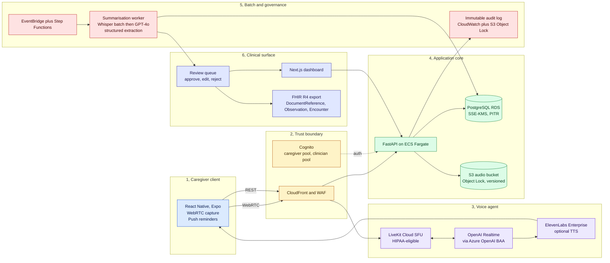

# AtendaCare MVP, Founding Engineer Memo (App-first variant)

**Author:** Fabrizio
**Recipient:** Christopher, Co-Founder and CCO, AtendaCare
**Subject:** Response to the nine technical questions
**Status:** Draft for discussion

---

## 0. Executive summary

Christopher, please find below my response to the nine questions you posed. To save you the scrolling, the headline assumptions and conclusions are tabulated first; the supporting argument follows in nine numbered sections.

| # | Question | Headline answer |
|---|----------|-----------------|
| Q1 | MVP architecture | React Native (Expo) client, WebRTC into LiveKit, OpenAI Realtime via Azure OpenAI, modular FastAPI monolith on ECS Fargate, Postgres + S3, nightly batch summarisation, Next.js clinician dashboard. |
| Q2 | Time to 60 caregivers | Twelve weeks to caregiver number one. Fourteen to sixteen weeks to all sixty. |
| Q3 | What I would NOT build | Telephony fallback; native iOS or Android codebase split; EHR integrations; self-serve onboarding; bespoke auth; multi-tenancy; vector store; fine-tuned model; real-time clinician paging. |
| Q4 | Half timeline | Drop to a mobile-web PWA, drop the dashboard, use a managed voice-agent platform, twenty caregivers instead of sixty, defer FHIR. |
| Q5 | Corners cut | Dashboard polish, dashboard tests, microservices, custom observability, stack diversity, generic extraction, multi-region. |
| Q6 | Corners refused | BAAs, encryption, audit log, clinician sign-off, consent, hallucination defence, log hygiene, restore drill, accessibility floor. |
| Q7 | Solo capacity | All of the above is buildable solo. Wall-clock for ops is the binding constraint, not lines of code. |
| Q8 | Engineer number two | When pilot retention is above sixty percent at week four. Their remit is the clinical extraction and evaluation pipeline. |
| Q9 | Risks | Older-adult app adoption, App Store rejection, real-world voice UX, PHI in LLM context, hallucination, reimbursement audit trail, voice cost-at-scale, bus factor of one. |

Each row is unpacked below. Where I disagree with the JD's stated assumptions, the section is marked **(pushback)**.

---

## 1. Q1, the proposed architecture

### 1.1 Single-sentence statement

A React Native client streams caregiver speech over WebRTC into a BAA-covered media server; a voice agent backed by OpenAI Realtime via Azure OpenAI runs the conversation; encrypted audio and transcripts settle in AWS; a nightly batch produces FHIR-shaped clinical summaries; every summary is reviewed by a clinician in a Next.js dashboard before it reaches the provider.

### 1.2 Architecture diagram

### 1.3 Rationale, by layer

- **Layer 1, client.** React Native via Expo means one codebase, OTA updates without an App Store cycle, and a web build in reserve. Native modules only where genuinely required.
- **Layer 2, trust boundary.** A single front door (CloudFront and WAF) and identity strictly separated by user pool. Caregiver and clinician identities never share a pool.
- **Layer 3, voice agent.** WebRTC into LiveKit gives us a HIPAA-eligible media path; OpenAI Realtime via Azure OpenAI gives us the BAA the OpenAI direct API does not extend for PHI. ElevenLabs Enterprise is held in reserve if the Realtime voice proves clinically too cold.
- **Layer 4, application core.** A modular monolith on FastAPI is sufficient for product-market fit. Postgres for everything structured; S3 for audio. No vector database until the absence of one is the bug.
- **Layer 5, batch and governance.** The clinical summary is read weekly. Synchronous summarisation buys nothing. The audit sink is the single artefact that determines whether we survive an OCR audit; it deserves its own layer.
- **Layer 6, clinical surface.** The review queue is the load-bearing UI surface in the pilot. FHIR is the export shape only; storage stays relational.

### 1.4 Cross-cutting principles

1. Single AWS account, single region, multi-AZ for RDS.
2. Terraform from day zero, two environments only: `dev` with synthetic data and `prod` with PHI. No third tier where PHI leaks tend to happen.
3. PHI never traverses a service that has not signed a BAA. Including in logs.

---

## 2. Q2, time to a pilot-ready MVP

### 2.1 Estimate

| Estimate | Outcome |
|----------|---------|
| Twelve weeks | First caregiver onboarded, real PHI flowing, audit story defensible. |
| Fourteen to sixteen weeks | All sixty caregivers onboarded in cohorts. |

The app surface is the principal reason this is two to three weeks longer than a phone-only plan would be.

### 2.2 Plan

| Weeks | Phase | Exit criteria |
|-------|-------|---------------|
| 1 to 2 | **Foundations.** | BAAs signed across AWS, LiveKit, Azure OpenAI, Expo EAS, and the chosen error reporter. Terraform skeleton merged. Postgres schema, KMS keys, audit pipeline operational. Apple Developer and Google Play accounts provisioned. CI with secrets handling. |
| 3 to 5 | **End-to-end voice loop.** | A test caregiver opens the app, holds a ten-minute scaffolded conversation, and the transcript plus audio land encrypted. Turn-taking under seven hundred milliseconds. Push notifications functional. |
| 6 to 7 | **Clinical extraction pipeline.** | Nightly batch produces a structured summary (behaviours, medication concerns, ADL changes, caregiver burden signals, escalation flags). Output validates against the FHIR schema. Reviewer UI supports approve, edit, reject. |
| 8 to 9 | **Clinician dashboard.** | Roster view, summary view, source-transcript drill-down, concern triage. Two real clinicians exercise it against synthetic data, and we fix what they object to. |
| 10 to 11 | **Hardening and store readiness.** | TestFlight and Play Internal Testing builds, accessibility pass (large type, voice prompts), penetration test of the auth surface, threat-model walkthrough, incident response runbook, consent flow, opt-out path. |
| 12 | **First ten caregivers.** | Real PHI, real users, manual onboarding. |
| 13 to 16 | **Cohort scale-out.** | Ten new caregivers per week. Weekly clinical accuracy review. The three most-reported caregiver complaints get shipped each week. |

### 2.3 Schedule-compressing measures

The two single-largest accelerants are: BAAs initiated on day one (legal frequently outruns engineering), and side-loading via TestFlight and Play Internal Testing rather than full store review for the pilot duration.

---

## 3. Q3, what I shall intentionally NOT build

In rough order of "tempting but no":

1. **No native iOS or Android codebase split.** Expo and React Native, one repository, OTA updates.
2. **No telephony fallback channel for the pilot. (pushback)** I take the view that one channel done correctly beats two channels each done by half. Q9 notes the risk I am taking on.
3. **No EHR integration.** FHIR bundles are delivered as a downloadable artefact; the pilot clinicians paste or attach. Real integration is a six-to-twelve-month sales decision.
4. **No self-serve provider onboarding flow.** Two pilot practices warrant a Zoom call each, not a wizard.
5. **No bespoke auth.** Cognito for clinicians; magic-link SMS for caregivers. No password reset paths to debug.
6. **No multi-tenancy.** Single schema with `provider_id` column. Hard tenancy when the second paying customer signs a contract.
7. **No internal admin tooling.** Retool or Metabase against a read replica.
8. **No vector store or RAG over conversation history.** GPT-4o's context window and a structured patient-profile row are sufficient for pilot scale.
9. **No A/B test framework, no feature-flag service beyond on or off, no internationalisation, no SDK, no marketing site beyond a single page.**
10. **No fine-tuned model.** Prompt-engineer first, evaluate hard, fine-tune only when the curve has visibly plateaued.
11. **No real-time clinician paging.** Flagged concerns enter a morning review queue. Real-time alerting is a regulatory posture change; the MVP cannot accommodate it.

---

## 4. Q4, if the timeline is halved

If the budget is six to eight weeks rather than twelve to sixteen, the following measures are on the table:

| Measure | Saved | Cost |
|---------|-------|------|
| Mobile-web PWA in place of native app | ~3 weeks | Worse push, worse audio reliability, no offline. |
| No clinician dashboard, summaries as PHI-safe PDF over portal or SFTP | ~2 weeks | Worse clinician UX, but pilot-acceptable. |
| Managed voice-agent platform (Vapi, Retell, or managed LiveKit Agents) | ~1.5 weeks | Vendor lock-in risk, less control over conversation policy. |
| Review in Linear or Google Docs, no review UI | ~1 week | Ugly. Works. |
| Twenty caregivers, not sixty | onboarding wall-clock | Smaller sample, but sufficient to prove the loop. |
| Defer FHIR formatting, ship JSON plus PDF | ~3 days | Re-add when the first paying provider asks. |

What I would never trade away to hit half-timeline: BAAs, audit logging, consent flow, clinician sign-off, or honest voice quality. Those are not shortcuts; they are tomorrow's lawsuits.

---

## 5. Q5, corners I would cut

- **Dashboard polish.** Functional Tailwind, no design system, no animations. Clinicians grade us on signal, not aesthetics.
- **Dashboard test coverage.** Heavy testing on the extraction pipeline and the audit-log path. Light testing on the UI.
- **Microservices, queues, sagas, anything carrying the word "distributed".** Modular monolith. Postgres is the queue (`SELECT ... FOR UPDATE SKIP LOCKED`) until volume forces a change.
- **Custom observability.** Datadog or Sentry under BAA. Buy dashboards, do not build them.
- **Stack diversity.** Python on the backend, TypeScript on the frontend, nothing else. There is no performance-critical path yet.
- **Generic extraction.** Prompts and schemas are dementia-specific. Parkinson's and CHF get forked prompt sets later. Premature abstraction over conditions is the costliest mistake available in month two.
- **Multi-region heroics.** Single region, multi-AZ for RDS only.

---

## 6. Q6, corners I would refuse to cut

These are non-negotiable. I would rather slip schedule than relax them.

1. **BAAs in place before any PHI touches any service.** No exceptions, including in development.
2. **Encryption at rest (customer-managed KMS in prod) and in transit (TLS 1.2 or higher).** Audio in S3 under SSE-KMS with Object Lock. RDS encrypted. Backups encrypted. On-device audio cache encrypted via Keychain-backed keys.
3. **Immutable, append-only, exportable audit logging on every PHI access.**
4. **Clinician sign-off on every summary in the pilot.** Yes, this caps scale. We are proving the loop, not running it at scale.
5. **Explicit caregiver consent, captured and revocable.** Recording disclosure on every session, a working "delete my data" path before caregiver number one.
6. **A real hallucination defence.** Strict schemas, per-field confidence scoring, citation back to transcript on every claim. If we cannot cite the line of transcript, the claim does not surface.
7. **PHI never leaves BAA-covered services, including in logs and crash reports.** Sentry SDK redaction at the device boundary. No PHI in Slack, ever.
8. **Backups and a rehearsed restore drill.** Not "we have backups". A documented exercise before pilot launch.
9. **Accessibility floor on the client.** Large type, high contrast, voice prompts on every screen. Caregivers are frequently older than the patient; if the app is hard to use, retention collapses.

---

## 7. Q7, solo capacity

Honest answer: yes, all of the above is buildable solo through pilot launch and the first sixty caregivers. The app surface does shift the load, however. Weeks nine through twelve concentrate hardening, App Store mechanics, and onboarding logistics simultaneously, and the wall-clock is tight.

The piece I would want a second pair of eyes on is not engineering. It is clinical content: the summary structure, what counts as a flagged concern, the prompt scaffolding for the conversation itself. That belongs to your COO and a clinician on a weekly cadence, not to a second engineer.

The constraint that bites in this phase is wall-clock for non-code work: BAA reviews, vendor evaluations, compliance documentation, incident response runbook, App Store submissions, caregiver onboarding. Approximately thirty percent of my time, budget accordingly.

---

## 8. Q8, engineer number two

### 8.1 Trigger

Pilot has signal. Concretely: caregiver retention above sixty percent at week four, clinicians voluntarily call the summaries useful, and we are in commercial conversations with a paying provider. Not earlier. Hiring against fear rather than evidence burns runway.

### 8.2 Remit

Clinical data extraction and evaluation pipeline. This is the single most leveraged area in the company over the following twelve months because

1. it is what differentiates us from a generic voice-AI vendor,
2. it is what unlocks expansion into Parkinson's, CHF, and COPD without a product rewrite, and
3. it is the surface area on which regulators and clinicians both grade us.

The job description includes "build the evaluation harness that detects when a prompt change made the summary worse", not "build features".

### 8.3 Engineer number three

Mobile and caregiver experience: accessibility for older caregivers, voice UX for the hard-of-hearing, the patient-direct version of the application when that surface opens up.

### 8.4 What I would not do

Staff up faster than this. Five engineers shipping in five directions without shared context is a worse company than two engineers who agree on what they are building.

---

## 9. Q9, technical risks visible from the outside

Listed by approximate severity for the app-first MVP.

1. **App adoption among older caregivers.** The single largest risk of the app-first plan. A meaningful fraction of dementia caregivers are between fifty-five and seventy-five themselves, exhausted, and not app-native. If they cannot install, log in, or remember to open the application, daily voice does not happen and the reimbursement code revenue model collapses. Mitigation: run a small phone-call comparison cohort to quantify the gap before scaling.
2. **App Store risk.** Apple holds opinions about health applications and AI. A rejection forty-eight hours before pilot launch is a real possibility. Mitigation: pilot via TestFlight and Play Internal Testing; treat full store submission as a separate work stream.
3. **Real-world voice UX.** Caregivers are interrupted mid-session by the person they are caring for. Ambient noise is high. ASR accuracy on emotional, fatigued, and accented speech is considerably worse than benchmark numbers suggest. We must measure word error rate on *our* caregivers, not on OpenAI's evaluation set.
4. **PHI in LLM context and prompt injection.** Even under BAA, anything placed in a model's context is a data-handling surface. We require a stated policy on what fields are sent, redaction of unrelated PHI, and a deliberate threat model around whether a caregiver can manipulate the agent into out-of-scope advice (for example, medication recommendations).
5. **Hallucination in clinical summaries.** The risk that ends the company if mishandled. Mitigation: strict structured extraction, per-field citation back to transcript, mandatory clinician sign-off, and a stated policy that we "inform clinical review only", consistent with the Enforcement Discretion posture, enforced in the product rather than the marketing copy.
6. **Reimbursement audit trail.** If a payer audits our RTM and CCM time documentation, we must be able to prove with timestamps, audio, transcript, and clinician review records that the documented time occurred, the patient consented, and a qualified clinician reviewed. This is a data-model decision in week one, not a patch in week twelve.
7. **Voice latency versus cost.** OpenAI Realtime is excellent and expensive. Fine at pilot scale. At ten thousand caregivers the arithmetic changes, and the voice stack is non-trivial to swap. Hence the clean interface at Layer 3.
8. **Bus factor of one.** A documented "what to do if Fabrizio is unavailable" runbook before caregiver number ten. Not paranoia. Table stakes for a system that handles PHI.

---

## 10. Closing

Christopher, my interest in this role is straightforward. You have already done the hard, unsexy work: reimbursement codes, compliance audit, clinical relationships, caregiver alpha list. Most "AI in healthcare" companies are still looking for the problem. You have the problem locked in and require someone who can ship the product cleanly inside the regulatory frame you have established. That is a kind of engineering problem I would very much enjoy.

I would be glad to take any of the above further in conversation, particularly the older-adult adoption risk, the clinical extraction pipeline, and the hallucination defence, which are the three I hold the strongest opinions on.

Best regards,
Fabrizio
