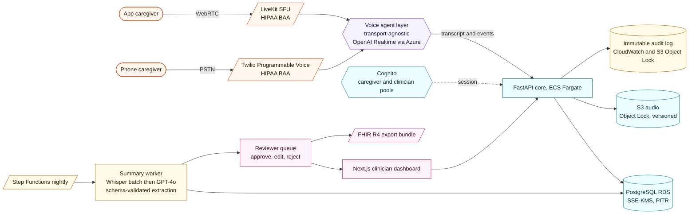

# Atenda founding-engineer reply, hybrid variant

Christopher,

I sat with your nine questions for a couple of evenings before writing anything down. They are good questions in the way that good questions usually are, they pull on the thread that actually matters, which in this case is whether the founding engineer understands that the product is not a voice agent. The product is a clinically-defensible loop that happens to use voice. Everything below follows from that.

The one early commitment that shapes the rest of this document: for the pilot I would run two channels in parallel, a React Native app and a Twilio phone number, both feeding the same backend and producing the same clinical summary. I will explain why under question one and again under question nine. The short version is that I do not yet know which channel our caregivers will adopt, and the architecture is cheap enough to let them tell us.

Written by Fang Zhang. Drafted on the assumption that you would rather read my reasoning than a deck.

---

## 1) On the architecture

The picture in my head is layered. On the left, two ways in. In the middle, one shared voice agent, one shared backend, one shared clinical pipeline. On the right, the clinician. The two channels are physically separated only at the transport, the LiveKit SFU for the app and the Twilio SIP termination for the phone. They merge at the voice-agent layer, which is the choice that makes the whole arrangement affordable.

A few notes on choices, in the order they matter:

The voice-agent layer is transport-agnostic by construction. The contract it exposes upward (transcript stream, conversation events, tool invocations) is identical for the phone channel and the app channel. That is the one piece of discipline that lets the second channel cost roughly one week of engineering instead of four. Get the contract right in week one, and everything afterward is configuration.

OpenAI Realtime via Azure OpenAI is the model loop. Azure carries the BAA. STT, LLM, and TTS collapse into a single socket, which is good for latency, good for empathy, and good for the number of vendor relationships I have to manage solo.

The application layer is a modular monolith on FastAPI. Microservices in a five-person company are a tax with no benefit. Modules with clean seams will split fine the day they need to.

Storage is unspectacular on purpose. Postgres for everything structured, S3 for audio with Object Lock, CMK-backed KMS for encryption, point-in-time recovery turned on. No vector database; pgvector if and when prior-conversation retrieval becomes the bug caregivers are reporting.

The summary pipeline is nightly, not real-time. Clinicians read these summaries weekly. Doing the work synchronously buys nothing and burns money. The job runs at three in the morning, structured extraction validates against a schema, and the output drops into a review queue.

The clinical surface is a Next.js dashboard sitting behind the review queue. Every summary is approved by a clinician before it reaches the provider during the pilot. FHIR R4 is the export shape, not the storage shape, which keeps the relational model honest.

One AWS account, one region, multi-AZ for RDS. Terraform from day zero. Two environments, dev with synthetic data and prod with PHI, and nothing in between. The staging-with-real-PHI tier is the single most reliable way I know to leak PHI.

---

## 2) On the timeline

My honest answer is eleven to twelve weeks to the first caregiver, fourteen to fifteen weeks to all sixty. The hybrid plan is roughly one week longer than an app-only plan would be, because the second channel reuses about eighty percent of the stack once the agent layer is transport-agnostic. If I were building two genuinely different products, the answer would be four weeks longer and I would not be proposing it.

The shape of the work, in plain order:

Weeks one and two are foundations. BAAs initiated across AWS, Twilio, LiveKit, Azure OpenAI, Expo, and whichever error reporter we choose. Terraform skeleton merged. Postgres schema written down. KMS keys created. Audit pipeline operational. CI plus secrets handling. Developer accounts. Most of this is paperwork, and most of it lives or dies on starting early.

Weeks three and four build the voice agent layer and bring the phone channel up first. Twilio inbound and outbound calls reach the agent, the agent runs a ten-minute scaffolded conversation on dementia caregiving topics, and the transcript and encrypted audio land in our buckets. The reason I do phone first is mechanical: it has fewer moving parts, so I learn the shape of the agent layer faster.

Weeks five and six bring the app channel up on the same agent. React Native pushes WebRTC audio into LiveKit, LiveKit into the same agent. Push notifications working. The transcript and event contract is identical to the phone channel; that is verified by automated test before we move on.

Weeks seven and eight are the clinical extraction pipeline. Nightly batch produces a structured summary of behaviors, medication concerns, ADL changes, caregiver burden signals, and escalation flags. The output validates against our FHIR-shaped schema. The reviewer UI handles approve, edit, and reject with the audit trail attached.

Weeks nine and ten harden the clinician dashboard against two real clinicians who use it on synthetic data and tell us what they hate.

Week eleven onboards the first ten caregivers, deliberately split across both channels. We do not choose for them. Week twelve through week fifteen scales to sixty in cohorts of ten, and the most important data we collect during that period is retention by channel, because that is the data we do not have today and the data that determines what we keep building.

---

## 3) On what I would not build

I am happier listing the things I am refusing to build than the things I am building, because the refusals are where founders usually disagree with founding engineers, and I would rather have the disagreement now than in week six.

I would not build feature parity between the two channels. The phone caregiver does not need a conversation history view; the app caregiver does. The app caregiver does not need a "press nine for a nurse" tree; the phone caregiver does. Each medium is allowed to be honest about what it is good at.

I would not split iOS and Android into separate codebases. Expo and React Native, one repo, over-the-air updates for everything that does not require a native module change.

I would not build EHR integrations in the pilot. FHIR export is a downloadable bundle, and pilot clinicians paste or attach it. Real EHR integration is a six-to-twelve-month sales decision, not an engineering one.

I would not build a self-serve provider onboarding flow. We have two pilot practices. I onboard them on Zoom calls.

I would not build custom authentication. Cognito for clinicians, magic-link SMS for caregivers via Twilio Verify. No password reset paths to debug.

I would not build multi-tenancy. A single schema with a `provider_id` column carries us through the second customer.

I would not build internal admin tooling. Retool or Metabase against a read replica.

I would not build a vector database or RAG over conversation history. The GPT-4o context window plus a structured patient-profile row covers the pilot. Memory becomes a feature when the absence of memory is the complaint.

I would not build A/B testing infrastructure, dark mode, internationalization, an SDK, or a marketing site beyond a single page.

I would not fine-tune a model. Prompt-engineer first, evaluate hard, and fine-tune only when the curve has visibly plateaued.

I would not build real-time clinician alerting. Flagged concerns enter the morning review queue. Real-time alerting starts to look like clinical decision support, and I do not want that scope creep in the pilot.

---

## 4) On a halved timeline

If the budget were six to eight weeks instead of eleven to fifteen, the hybrid plan compresses cleanly because the two-channel design lets me drop the harder one rather than gut the whole product.

I would ship the phone channel only for the pilot. Twilio plus agent plus backend plus summary pipeline. The app comes after pilot signal. The eventual app rollout survives because we already designed the agent layer transport-agnostic; it is not a rewrite, it is a second adapter.

I would drop the clinician dashboard. Summaries go to clinicians as PHI-safe PDFs over a portal link or a shared SFTP. Ugly. Works.

I would use a managed voice-agent platform for the phone channel, Vapi or Retell or Bland, whichever has a signed BAA and a tolerable data residency story. The cost is some control over the conversation policy. I am willing to pay that to skip building the orchestration layer myself.

I would do clinical review in Linear or Google Docs. Summaries are exported as Markdown, edited, signed off, and sent.

I would cut the cohort to twenty caregivers, all on phone, and tell you why honestly. Twenty is enough to prove the loop.

I would defer FHIR formatting. Structured JSON and PDF. FHIR rendering becomes a two-day task the day a paying provider asks.

What I would never do to make the half-timeline: skip BAAs, skip audit logging, skip consent flow, skip clinician sign-off on summaries, or fake the voice quality with a Wizard-of-Oz demo and call it a pilot. Those are not corners; they are lawsuits.

---

## 5) On the corners I would cut

I would cut UI polish on the clinician dashboard. Functional Tailwind, no design system, no animations. The caregiver app earns more attention because it drives retention; the dashboard earns enough to be usable.

I would cut test coverage on the dashboard. Heavy testing on the backend extraction pipeline, the audit-log path, and the agent layer's transport-agnostic contract. Light testing on the UI.

I would cut microservices, queues, sagas, and anything labelled distributed. Modular monolith, Postgres as the queue with `SELECT FOR UPDATE SKIP LOCKED`, until volume forces me to change my mind.

I would cut custom observability. Datadog or Sentry under BAA. Buy dashboards, do not build them.

I would cut stack diversity. Python on the backend, TypeScript on the frontend, and nothing else. No Rust microservice for the performance-critical path that does not exist.

I would cut generic extraction. Prompts and schemas are dementia-specific. Parkinson's, CHF, and COPD get forked prompt sets later. Premature abstraction across conditions is the costliest engineering decision available to me in month two.

I would cut multi-region heroics. Single region, multi-AZ for RDS only.

---

## 6) On the corners I would refuse to cut

These are the items I would slip the timeline rather than relax.

The first is BAAs in place before any PHI touches any service, including in development. If a vendor has not signed, we do not send.

The second is encryption everywhere. KMS with customer-managed keys in prod, TLS 1.2 or higher in transit, SSE-KMS plus Object Lock on the audio bucket, encrypted backups, and on-device audio caches encrypted via Keychain-backed keys.

The third is immutable, append-only, exportable audit logging on every PHI access. This is the single thing that determines whether we survive an OCR audit.

The fourth is clinician sign-off on every summary in the pilot. Yes, this caps scale. We are proving the loop, not running it at scale.

The fifth is explicit caregiver consent, captured and revocable, per channel. Recording disclosure on every phone call and every app session. A working delete-my-data path before caregiver number one.

The sixth is a real hallucination defense. Strict schemas, per-field confidence scoring, and a citation back to a specific line of transcript on every claim. If we cannot cite the line, we do not surface the claim.

The seventh is PHI staying inside BAA-covered services, including in logs and crash reports. Sentry redaction at the SDK boundary on-device. No PHI in Slack, ever.

The eighth is backups with a tested restore. Not "we have backups". A rehearsed drill before pilot launch.

The ninth is a channel-agnostic data model. Phone summaries and app summaries are the same shape, the same quality, the same audit story. We do not run a second-class channel.

---

## 7) On building this solo

Honestly, all of it, through pilot launch and the first sixty caregivers. The reason the hybrid plan is feasible solo is the discipline above, the agent layer is transport-agnostic from week one, and the second channel is mostly a Twilio configuration and a thin adapter. Bolting the second channel on in month four would be a four-engineer-week job; doing it in parallel from day zero is roughly one extra week of work distributed across the build.

The piece I want a second pair of eyes on is not engineering. It is clinical content. The summary structure, what counts as a flagged concern, the conversation prompt scaffolding. That belongs to your COO and a clinician on a weekly cadence, not to a second engineer.

The constraint that bites in this phase is wall-clock for non-code work. BAA reviews, vendor evaluations, compliance documentation, incident response runbook, app store submissions, the first caregiver onboardings across two channels. Roughly thirty percent of my time goes there. Budget accordingly.

---

## 8) On engineer number two

The trigger is signal, not anxiety. Caregiver retention above sixty percent at week four, clinicians voluntarily describing the summaries as useful, and live conversations with paying providers. Not before. Hiring against fear instead of evidence is how early-stage companies burn runway.

Their remit is the clinical data extraction and evaluation pipeline. This is the most leveraged area in the company over the next twelve months, because it is what separates us from a generic voice-AI vendor, what unlocks expansion across conditions without a product rewrite, and the surface area on which both regulators and clinicians grade us. Their job description includes building the evaluation harness that detects when a prompt change made the summary worse, not just building features.

Engineer number three goes to whichever channel is winning, and the answer might surprise us. If the app dominates retention, more mobile depth. If the phone channel dominates, more voice UX and telephony depth. The hybrid pilot is partly a hiring signal.

---

## 9) On the risks

The honest risks, in the order I think about them.

The hybrid-specific risk first. Two channels means two surfaces to keep honest. The defense is the transport-agnostic agent layer and one shared summary contract, and that defense is engineering discipline rather than architecture. If one channel quietly diverges in prompt, in summary quality, or in audit edge cases, the company has two products instead of one, and neither is loved.

App adoption among older caregivers. A meaningful fraction of dementia caregivers are between fifty-five and seventy-five themselves, exhausted, and not app-native. The hybrid plan is in part insurance against this, but if ninety percent of caregivers gravitate to the phone, we should know that and act on it instead of pretending the app is doing fine.

Voice UX in messy real-world conditions. Caregivers are interrupted mid-session by the person they care for. Ambient noise is high. ASR accuracy on emotional, fatigued, accented speech is materially worse than benchmark numbers suggest. We will need to measure WER on our caregivers, not on the model vendor's evaluation set.

PHI in LLM context and prompt injection. Even under BAA, anything we put in a model's context is a data-handling surface. We need a policy on what fields we send, redaction of unrelated PHI, and a threat model around whether a caregiver can manipulate the agent into out-of-scope advice, especially medication recommendations.

Hallucination in clinical summaries. The risk that ends the company if we mishandle it. Mitigation is the strict structured extraction, per-claim citation back to transcript, mandatory clinician sign-off, and a published policy that we inform clinical review only, consistent with the Enforcement Discretion posture, enforced in product rather than in marketing copy.

Reimbursement audit trail. If a payer audits our RTM and CCM documentation, we must be able to prove with timestamps, audio, transcript, and clinician review records that the documented time happened, the patient consented, and a qualified clinician reviewed. Per-channel provenance has to be in the data model from week one, not patched in week twelve.

Voice latency versus cost. OpenAI Realtime is excellent and expensive. Fine at pilot scale. At ten thousand caregivers across two channels the arithmetic changes, and the voice stack is non-trivial to swap. Hence the clean interface at the agent layer.

Vendor concentration. Twilio, LiveKit, Azure OpenAI, AWS. Four vendors who could each end us through an outage or a policy change. Multi-provider is not a month-one investment. Knowing the exit path for each is.

Bus factor of one. A documented runbook covering what happens if I am unavailable, in place before caregiver number ten. Not paranoia. Table stakes for a system handling PHI.

---

## Closing

Christopher, the reason I am interested is that you have already done the hard, unsexy work. Reimbursement codes, compliance audit, clinical relationships, caregiver alpha list. Most AI-in-healthcare companies are still looking for the problem. You have the problem locked in and need someone who can ship the product cleanly inside the regulatory frame you have built. That is the kind of engineering problem I would enjoy.

I would happily go deeper on any of the above on a call, particularly the channel split, the clinical extraction pipeline, and the hallucination story, which are the three I have the strongest opinions about.

Fang
