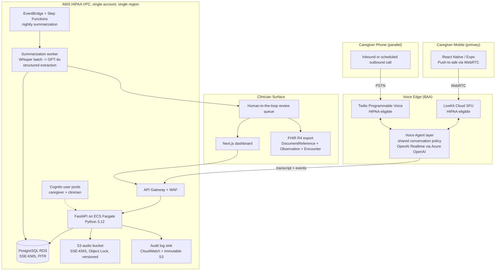

# Atenda MVP - Founding Engineer Response (Hybrid variant)

---

## Suggested email body (paste into reply to Christopher)

> Hi Christopher,
>
> Thanks, really appreciated the question. I put my thinking into the attached doc, including an architecture sketch.
>
> Short version: I'd build the mobile-first product the JD describes, but I'd ship a **phone-call channel alongside it for the pilot**. Same backend, same summaries, two ways in, because daily voice with dementia caregivers needs whatever channel works for the caregiver in front of us, and I think running both during the pilot is what gets us to honest retention numbers fastest.
>
> Happy to dig into the channel split, the hallucination story, or the FHIR mapping on a call. Those are the three I have the most opinions on.
>
> Cheers,
> Fang

---

## Attached doc

# Atenda MVP - Founding Engineer Response

**From:** Fang Zhang
**To:** Christopher (Co-Founder & CCO, AtendaCare)
**Re:** Your nine questions

---

### A quick framing note

Christopher, thanks for skipping the resume theatre. I'll do the same and answer in plain language, with opinions. Every answer below assumes one principle: **the only thing that matters in the first 90 days is getting a clinically-pilotable loop into 60 caregivers' hands without ever putting PHI somewhere a BAA doesn't cover.** Everything else is a knob to tune.

One opinionated up-front choice that shapes the rest of my answers: **for the pilot, I'd ship two channels, a React Native app as the primary surface and a Twilio phone-call channel as a parallel path.** Both feed the same backend, both produce the same FHIR-shaped summaries, both honor the same consent and audit trail. The reason isn't channel diversification for its own sake. It's that daily voice with dementia caregivers needs to meet the caregiver where they actually are, and we don't yet know what fraction of our population will adopt a mobile app vs. a phone call. Running both during the pilot is the cheapest way to learn that, and the architecture below is shaped so the second channel is genuinely cheap to keep alongside the first.

---

### 1. If I were founding engineer, what would the MVP architecture look like?

**One sentence:** A React Native app and a Twilio phone number both pipe caregiver voice through a BAA-covered voice agent into a single backend, encrypted audio + transcript land in AWS, a nightly batch pipeline produces FHIR-shaped summaries, and a clinician reviews each in a Next.js dashboard before it reaches the provider.

**Key choices and why:**

- **One voice-agent layer, two transports.** The Twilio path and the LiveKit/app path both terminate at the same conversation policy: same prompts, same tools, same logging contract. The cost of running both channels is dominated by per-minute usage, not engineering surface, as long as we design the agent layer transport-agnostic from day one. Doing this *later* is hard; doing this *now* is mostly discipline.
- **React Native via Expo** for the app channel. One codebase, OTA updates without app review, web build as a bonus.
- **Twilio Programmable Voice** for the phone channel. HIPAA-eligible under BAA. Caregivers can call a number or be called on schedule.
- **OpenAI Realtime via Azure OpenAI** for STT + LLM + TTS. Azure gives us the BAA OpenAI's standard API does not for PHI. Single vendor for the model loop.
- **Modular monolith on FastAPI / ECS Fargate**, not microservices. One service, clean module boundaries. We're three months from product-market fit, not from scale problems.
- **Postgres for everything structured, S3 for audio**, no vector DB until we actually need RAG over prior conversations.
- **Nightly batch summarization**, not real-time. Clinical summaries are read weekly/biweekly. Batch runs at 3 a.m., outputs land in a clinician review queue.
- **Human-in-the-loop on every summary** for the pilot. A clinician (or trained ops person) approves each before it goes to the provider. Only honest way to ship an LLM-generated clinical artifact under Enforcement Discretion in month one.
- **FHIR R4 as the export shape, not the storage shape.** Internally we store flat-ish Postgres tables; we render `DocumentReference` + `Observation` + `Encounter` resources at export time.
- **Single AWS account, single region, IaC from day zero** (Terraform). Two environments: `dev` (synthetic data, never PHI) and `prod` (PHI, locked down).

---

### 2. How quickly to a pilot-ready MVP in 60 caregivers' hands?

**My honest answer: 11 to 12 weeks to first caregiver, 14 to 15 weeks to all 60.** The two-channel architecture costs about 1 week vs. an app-only build, because most of the savings come from sharing the agent layer, the backend, the summary pipeline, and the audit trail. The phone channel becomes mostly a Twilio configuration job once the agent layer is transport-agnostic.

| Weeks | Phase | Exit criteria |
|------|-------|---------------|
| 1 to 2 | **Foundations** | BAAs signed (AWS, Twilio, LiveKit, Azure OpenAI, Expo EAS, error reporting). Terraform skeleton. Postgres schema. KMS keys. Audit log pipeline. Developer accounts. CI/CD with secrets. |
| 3 to 4 | **Voice agent layer + phone channel** | Twilio inbound + outbound calls reach the shared agent. End-to-end: caregiver calls a number, has a 10-min conversation, transcript + audio land encrypted. Latency under ~700 ms turn-taking. |
| 5 to 6 | **App channel on the same agent** | React Native app pushes WebRTC audio into LiveKit, into the same agent layer, into the same backend. Push notifications working. Same transcript contract. |
| 7 to 8 | **Clinical extraction pipeline** | Nightly job converts a transcript into a structured summary (behaviors, meds concerns, ADL changes, caregiver burden signals, escalation flags). Output validates against our FHIR schema. Clinician-in-the-loop UI. |
| 9 to 10 | **Clinician dashboard + iteration** | Provider can log in, see roster, read approved summaries, drill into source transcript, mark concerns reviewed. Two real clinicians use it on synthetic data and we fix what they hate. |
| 11 | **First 10 caregivers (channel split)** | Some opt into the app, some into the phone. We don't choose for them. Manual onboarding. |
| 12 to 15 | **Scale to 60 + iterate** | Cohorts of 10/week. Track retention by channel: this is the data we don't have today and most need. Weekly clinical accuracy review. Ship the top 3 caregiver-reported pain points each week. |

The hybrid timeline is **only** 1 week longer than the app-only version because the second channel reuses ~80% of the stack. If I were designing two truly different products, it would be 4+ weeks longer and not worth it.

---

### 3. What would I intentionally NOT build?

In rough order of "tempting but no":

1. **Feature parity between channels.** The phone channel doesn't get a conversation history view; the app does. The app doesn't get a "press 9 to reach a nurse" tree; phone does. Each channel is allowed to be honest about its medium.
2. **A separate iOS and Android codebase.** Expo + RN, one repo, OTA updates.
3. **EHR integrations (Epic, Athena, etc.).** FHIR export as a downloadable bundle. Pilot clinicians copy/paste into the EHR or use the bundle. Real EHR integration is months 6 to 12 and is a sales decision, not an engineering one.
4. **A self-serve provider onboarding flow.** Two pilot practices? I onboard them manually.
5. **Custom auth/IDP.** Cognito for clinicians, magic-link SMS for caregivers via Twilio Verify. No password resets to debug.
6. **Multi-tenancy.** Single shared schema with a `provider_id` column. Real multi-tenancy when the second paying customer signs.
7. **Internal admin tools.** Retool or Metabase pointed at a read-replica.
8. **A vector DB / RAG over conversation history.** GPT-4o's context window plus a structured "patient profile" row is enough for the pilot.
9. **A/B testing, feature flags beyond simple on/off, internationalization, dark mode, an SDK, a marketing site beyond a single page.**
10. **A fine-tuned model.** Prompt-engineer first, evaluate hard, fine-tune only when prompt engineering has clearly plateaued.
11. **Real-time clinician alerting.** "Flagged concern" goes into the morning review queue, not a pager. Real-time alerting is a regulatory posture change (it starts to look like clinical decision support).

---

### 4. If the timeline gets cut in half, what changes?

If you handed me 6 to 8 weeks instead of 11 to 15, here's what I'd actually do, and the hybrid plan compresses cleanly because we already have two channels and can drop the harder one:

- **Ship the phone channel only for the pilot.** Twilio + agent + backend + summary pipeline. The app comes after pilot signal. Caregivers get the simpler onboarding, we get the simpler stack, and the architecture survives the eventual app rollout because we already designed the agent layer transport-agnostic.
- **Drop the clinician dashboard entirely.** Summaries go to clinicians as PHI-safe PDFs via a secure portal link, or as a download from a shared SFTP.
- **Use a managed voice-agent platform end-to-end** for the phone channel: Vapi, Retell, or Bland (whichever has a signed BAA). Skip building the agent orchestration ourselves.
- **Skip the human-in-the-loop UI; do review in Linear or Google Docs.** Summaries exported as Markdown, edited in a doc, signed off, sent to provider.
- **Cut the cohort to 20 caregivers**, all on phone, and tell you why honestly.
- **Defer FHIR formatting.** Ship summaries as structured JSON + PDF.

What I would **not** do to hit a half-timeline: skip BAAs, skip audit logging, skip consent flow, skip clinician sign-off on summaries, or fake the voice quality with a Wizard-of-Oz demo and call it a pilot. Those aren't shortcuts; they're tomorrow's lawsuit.

---

### 5. What corners would I cut?

- **UI polish on the clinician dashboard.** Functional Tailwind, no design system, no animations. The caregiver app gets more love because it directly drives retention.
- **Test coverage on the dashboard.** Heavy testing on the backend extraction pipeline, the audit log path, and the agent layer's transport-agnostic contract. Light testing on UI.
- **Microservices, queues, sagas, anything with the word "distributed."** Modular monolith, Postgres as the queue (`SELECT ... FOR UPDATE SKIP LOCKED`).
- **Custom observability.** Datadog or Sentry under BAA.
- **Stack diversity.** Python on the backend, TypeScript everywhere on the frontend.
- **"Generic" extraction.** Prompts and schemas are dementia-specific. We fork the prompt set per condition later.
- **Multi-region heroics.** Single region, multi-AZ for RDS only.

---

### 6. What corners would I refuse to cut?

These are the non-negotiables, and I'd rather slip the timeline than compromise them:

1. **BAAs in place before any PHI touches any service.** No exceptions. If a vendor doesn't have a BAA, we don't send them PHI, even in dev.
2. **Encryption at rest (KMS, customer-managed keys for prod) and in transit (TLS 1.2+) everywhere.** Audio in S3 is `SSE-KMS` with Object Lock. RDS encrypted. Backups encrypted. On-device audio cache encrypted via Keychain-backed keys.
3. **Audit logging on every PHI access: immutable, append-only, exportable.** Survives an OCR audit.
4. **Clinician sign-off on every summary in the pilot.**
5. **Explicit caregiver consent, captured and revocable, per channel.** Recording disclosure on every call and every app session. A working "delete my data" path before we onboard caregiver #1.
6. **A real hallucination story.** Structured extraction with strict schemas, confidence scoring on each field, citation-back-to-transcript on every claim.
7. **PHI never leaves BAA-covered services, including in logs and crash reports.**
8. **Backups and a tested restore.** Documented, rehearsed drill before pilot launch.
9. **Channel-agnostic data model.** Phone summaries and app summaries are the same shape, the same quality, the same audit story. No second-class channel.

---

### 7. How much of this can I realistically build solo?

Honestly? **All of it, through pilot launch and the first 60 caregivers.** The reason the hybrid plan is feasible solo is that the second channel is mostly a Twilio config and a thin transport adapter, *if* the agent layer is designed transport-agnostic from week one. If we tried to bolt phone on in month four, it would be a four-engineer-week job. Built in parallel from day zero, it's roughly an extra week of work spread across the build.

The piece I'd want a second pair of eyes on isn't engineering, it's clinical content: the summary structure, what counts as a "flagged concern," the conversation prompt scaffolding. That needs your COO and a real clinician in the loop weekly, not a second engineer.

The honest constraint isn't lines of code; it's **wall-clock for ops work**: BAA reviews, vendor evaluations, compliance documentation, incident response runbook, app store submissions, the first caregiver onboardings across two channels. That's where solo founding-engineer life gets thin. Roughly 30% of my time goes to non-code work in this phase.

---

### 8. When would I bring in engineer #2, and what would I want them on?

**Trigger:** the pilot has signal. Caregiver retention above ~60% at week 4, clinicians say the summaries are useful, and we're starting conversations with paying providers. Not before. Hiring against fear instead of evidence is how early-stage companies burn runway.

**Their focus:** the **clinical data extraction and evaluation pipeline.** This is the single most leveraged area in the company over the next 12 months because (a) it's what differentiates us from generic voice-AI tools, (b) it's what unlocks expansion to Parkinson's, CHF, COPD without rewriting the product, and (c) it's the surface area regulators and clinicians both judge us on. I want someone whose job description includes "build the evaluation harness that tells us when a prompt change made the summary worse," not just "build features."

Engineer #3 goes on **whichever channel is winning**, and the answer might surprise us. If the app dominates retention, more mobile depth; if the phone channel dominates, more voice-UX and telephony depth.

---

### 9. Technical risks that jump out from the outside

1. **Two channels = two surfaces to keep honest.** The biggest risk of the hybrid approach is that one channel quietly rots: different prompts, different summary quality, different audit edge cases. The defense is the transport-agnostic agent layer and one shared summary contract. The work is engineering discipline, not architecture.
2. **App adoption among older caregivers.** Many dementia caregivers are 55 to 75 themselves, exhausted, and not app-native. The hybrid plan is partly insurance against this risk, but if 90% of caregivers gravitate to phone, we should know that and act on it.
3. **Voice UX in messy real-world conditions.** Caregivers are interrupted mid-session, ambient noise is high, ASR accuracy on emotional, fatigued, or accented speech is worse than benchmarks suggest. WER on *our* caregivers, not OpenAI's evals.
4. **PHI in LLM context and prompt-injection.** Even with a BAA, anything we put in a model's context is a data-handling surface. We need a clear policy on what fields we send, redaction of unrelated PHI, and a serious think about whether a caregiver can manipulate the agent into doing something it shouldn't (e.g., medication recommendations we're not authorized to make).
5. **Hallucination in clinical summaries.** This is the one that ends the company if we get it wrong. Mitigation: strict structured extraction, citation-back-to-transcript on every claim, clinician sign-off, and a published policy that we "inform clinical review only."
6. **Reimbursement audit trail.** If a payer audits our RTM/CCM time documentation, we need to be able to prove (with timestamps, audio, transcript, and clinician review records) that the documented time happened, the patient consented, and a qualified clinician reviewed. Per-channel provenance has to be in the data model from week one.
7. **Voice latency vs. cost.** OpenAI Realtime is excellent and expensive. At pilot scale, fine. At 10,000 caregivers across two channels, the math changes. Voice layer behind a clean interface so we can swap providers.
8. **Vendor concentration.** Twilio + LiveKit + Azure OpenAI + AWS = four vendors who could each end us. Multi-provider isn't a month-one investment, but knowing the exit path for each is.
9. **Single founding engineer = bus factor of one.** I'd want a documented "what to do if Fang gets hit by a bus" runbook before we hit even 10 caregivers. Not paranoia, table stakes for handling PHI.

---

### Closing

Christopher, the reason I'm interested in this is straightforward: you've already done the hard, unsexy work, reimbursement codes, compliance audit, clinical relationships, caregiver alpha list. Most "AI in healthcare" companies are looking for the problem. You've got the problem locked in and need someone who can ship the product cleanly inside the regulatory frame you've already established. That's a kind of engineering problem I'd genuinely enjoy.

Happy to go deeper on any of these in the technical conversation, particularly the channel split, the clinical extraction pipeline, and the hallucination story, since those are the three I have the most opinions on.

Fang
