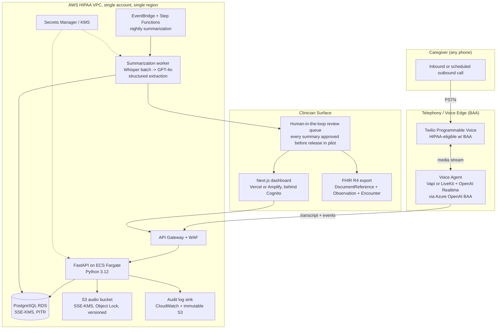

# Atenda MVP, Founding Engineer Response (Phone-first variant)

---

## Suggested email body (paste into reply to Christopher)

> Hi Christopher,
>
> Thanks, really appreciated the question. Rather than a few bullet points I put my thinking into the attached doc, including an architecture sketch.
>
> The short version: I'd go **phone-first, not app-first** for the pilot. I think it's the faster, cheaper, more caregiver-friendly path to 60 real users and it changes most of the downstream answers. I make the case in Q1 and Q3.
>
> Happy to dig into any of this on a call, the conversation design, the hallucination story, and the FHIR mapping are the three I have the most opinions on.
>
> Cheers,
> Fang

---

## Attached doc

# Atenda MVP, Founding Engineer Response

**From:** Fang Zhang
**To:** Christopher (Co-Founder & CCO, AtendaCare)
**Re:** Your nine questions

---

### A quick framing note

Christopher, thanks for skipping the resume theatre. I'll do the same and answer in plain language, with opinions. Every answer below assumes one principle: **the only thing that matters in the first 90 days is getting a clinically-pilotable loop into 60 caregivers' hands without ever putting PHI somewhere a BAA doesn't cover.** Everything else is a knob to tune.

One opinionated up-front choice that shapes the rest of my answers: **for the pilot, I'd go phone-first, not app-first.** Daily voice with dementia caregivers, many of whom are 55-75 themselves, exhausted, and not app-native, is a behavior change problem before it's a software problem. A phone number that rings them at 7 p.m. and just works is faster to ship, cheaper to maintain, and has a higher chance of pilot retention than any React Native app I could build in the same window. The mobile/web app comes as fast-follow once we've proven the conversation loop and the clinical summary loop. I think that's a real disagreement with the stated assumption in the JD, and I'd want to talk it through.

---

### 1. If I were founding engineer, what would the MVP architecture look like?

**One sentence:** A Twilio phone call → BAA-covered voice AI agent → encrypted audio + transcript in AWS → nightly summarization pipeline → FHIR-shaped summaries reviewed by a clinician in a thin Next.js dashboard.

**Key choices and why:**

- **Telephony over app for pilot.** Twilio Voice is HIPAA-eligible under a BAA. Zero install friction. Works on flip phones. Caregivers can talk while making dinner.
- **Voice agent layer: Vapi or LiveKit Agents wrapping OpenAI Realtime via Azure OpenAI** (Azure gives us the BAA OpenAI's standard API does not for PHI). Realtime collapses STT/LLM/TTS into one socket, better latency, better empathy modeling, and one vendor relationship instead of three.
- **Modular monolith, not microservices.** One FastAPI service, clean module boundaries. We're three months from product-market fit, not from scale problems.
- **Postgres for everything structured, S3 for audio.** No vector DB until we actually need RAG over prior conversations, and even then, pgvector first.
- **Nightly batch summarization, not real-time.** The clinical summary is read weekly/biweekly. Synchronous summarization buys us nothing and burns money. Batch runs at 3 a.m., outputs land in a review queue.
- **Human-in-the-loop on every summary for the pilot.** A clinician (or trained ops person) approves each one before it goes to the provider. This is the only honest way to ship an LLM-generated clinical artifact under Enforcement Discretion in month one.
- **FHIR R4 as the export shape, not the storage shape.** Internally we store flat-ish Postgres tables; we render FHIR `DocumentReference` + `Observation` + `Encounter` resources at export time. This avoids letting FHIR's data model leak into every CRUD operation.
- **Single AWS account, single region, IaC from day zero** (Terraform). Two environments only: `dev` (synthetic data, never PHI) and `prod` (PHI, locked down). No "staging-with-real-PHI" middle tier, that's where leaks happen.

---

### 2. How quickly to a pilot-ready MVP in 60 caregivers' hands?

**My honest answer: 10 weeks to first caregiver, 12-14 weeks to all 60.** Not "demo-ready", pilot-ready, meaning real PHI is flowing, clinicians are reading real summaries, and we can survive an audit conversation.

| Weeks | Phase | Exit criteria |
|------|-------|---------------|
| 1-2 | **Foundations** | BAAs signed (AWS, Twilio, Azure OpenAI, Vapi/LiveKit, ElevenLabs Enterprise if used, error reporting vendor). Terraform skeleton. Postgres schema. KMS keys. Audit log pipeline. CI/CD with secrets handling. |
| 3-4 | **Voice loop works end-to-end** | A caregiver can call a number, have a 10-minute scaffolded conversation with the agent on dementia caregiving topics, hang up, and have the transcript + audio land encrypted in our buckets. Latency under ~700 ms turn-taking. |
| 5-6 | **Clinical extraction pipeline** | Nightly job converts a transcript into a structured summary (behaviors, meds concerns, ADL changes, caregiver burden signals, escalation flags). Output validates against our FHIR schema. Clinician-in-the-loop UI for review and approve/edit/reject. |
| 7-8 | **Clinician dashboard + iteration** | Provider can log in, see their patient roster, read approved summaries, drill into source transcript, mark concerns reviewed. Two real clinicians use it on synthetic data and we fix what they hate. |
| 9-10 | **Hardening + first 10 caregivers** | Penetration test on auth surface, threat model walkthrough, runbook for incident response, on-call rotation (just me, but documented), real consent flow, opt-out. First 10 caregivers onboarded and called. |
| 11-14 | **Scale to 60 + iterate** | Onboard remaining 50 in cohorts of 10/week. Weekly clinical accuracy review. Tune prompts and extraction. Ship the top 3 caregiver-reported pain points each week. |

Two things compress this timeline more than anything else: **BAAs starting on day one** (legal often takes longer than code) and **the clinician-reviewer being a real person on the team from week 5**, not someone we hire later.

---

### 3. What would I intentionally NOT build?

In rough order of "tempting but no":

1. **A native mobile app.** Phone + SMS reminder is enough for the pilot. App goes in months 4-6 once we know what caregivers actually want to see on a screen.
2. **EHR integrations (Epic, Athena, etc.).** FHIR export as a downloadable bundle. Pilot clinicians copy/paste into the EHR or use the bundle. Real EHR integration is months 6-12 and is a sales decision, not an engineering one.
3. **A self-serve provider onboarding flow.** We have, what, two pilot practices? I onboard them manually over Zoom.
4. **Custom auth/IDP.** Cognito for clinicians, magic-link SMS for caregivers via Twilio Verify. No password resets to debug.
5. **Multi-tenancy.** Single shared schema with a `provider_id` column. Real multi-tenancy when the second paying customer signs.
6. **Internal admin tools.** Retool or Metabase pointed at a read-replica. I'm not building CRUD screens for ourselves.
7. **A vector DB / RAG over conversation history.** GPT-4o's context window plus a structured "patient profile" row is enough for the pilot. Don't build a memory system until the absence of one is the bug caregivers are reporting.
8. **A/B testing infrastructure, feature flags beyond a simple on/off, internationalization, dark mode, an SDK.**
9. **A fine-tuned model.** Prompt-engineer first, evaluate hard, fine-tune only when prompt engineering has clearly plateaued.
10. **Real-time clinician alerting.** "Flagged concern" goes into the morning review queue, not a pager. Real-time alerting is a regulatory posture change (it starts to look like clinical decision support) and I don't want that scope creep in the MVP.

---

### 4. If the timeline gets cut in half, what changes?

If you handed me 5-7 weeks instead of 10-14, here's what I'd actually do:

- **Drop the dashboard entirely.** Summaries go to clinicians as PHI-safe PDFs via a secure portal link (one Next.js page behind Cognito), or as a download from a shared SFTP. Building a real UI is the single most cuttable thing.
- **Use a managed voice-agent platform end-to-end**, Vapi, Retell, or Bland (whichever already has a signed BAA and a workable data residency story). I'd give up some control over the conversation policy to skip building the voice orchestration layer myself. The tradeoff: vendor lock-in risk, but pilot first, lock-in later.
- **Skip the human-in-the-loop UI; do review in Linear or Google Docs.** Summaries get exported as Markdown, the clinical reviewer edits in a doc, signs off, we send to provider. Ugly. Works.
- **Cut the cohort to 20 caregivers, not 60**, and tell you why honestly. 20 is enough to prove the loop and is much faster to onboard with the manual processes above.
- **Defer FHIR formatting.** Ship summaries as structured JSON + PDF. FHIR rendering becomes a 2-day task once we have a paying provider who actually consumes it.
- **One environment with stricter access controls instead of two.** Saves a week of Terraform plumbing. Higher operational risk; manageable for a 5-person company.

What I would **not** do to hit a half-timeline: skip BAAs, skip audit logging, skip consent flow, skip clinician sign-off on summaries, or fake the voice quality with a Wizard-of-Oz demo and call it a pilot. Those aren't shortcuts; they're tomorrow's lawsuit.

---

### 5. What corners would I cut?

- **UI polish.** Functional Tailwind, no design system, no animations. Caregivers don't see it; clinicians grade us on signal-to-noise, not aesthetics.
- **Test coverage on the dashboard.** Heavy testing on the backend extraction pipeline and the audit log path. Light testing on UI.
- **Microservices, queues, sagas, anything with the word "distributed."** Modular monolith, synchronous calls, Postgres as the queue (using `SELECT … FOR UPDATE SKIP LOCKED`) until traffic forces otherwise.
- **Custom observability.** Datadog or Sentry under BAA. Don't build dashboards; buy them.
- **Stack diversity.** Python everywhere on the backend. TypeScript everywhere on the frontend. No Rust microservice for the "performance-critical" path. There is no performance-critical path yet.
- **"Generic" extraction.** Prompts and schemas are dementia-specific. When we expand to Parkinson's or CHF, we fork the prompt set. Premature abstraction over conditions is the dumbest thing I could do in month two.
- **Multi-region, multi-AZ heroics.** Single region, multi-AZ for RDS only. We have 60 users.

---

### 6. What corners would I refuse to cut?

These are the non-negotiables, and I'd rather slip the timeline than compromise them:

1. **BAAs in place before any PHI touches any service.** No exceptions. If a vendor doesn't have a BAA, we don't send them PHI, even in dev.
2. **Encryption at rest (KMS, customer-managed keys for prod) and in transit (TLS 1.2+) everywhere.** Audio in S3 is `SSE-KMS` with Object Lock. RDS encrypted with KMS. Backups encrypted.
3. **Audit logging on every PHI access, immutable, append-only, exportable.** This is the single thing that determines whether we survive an OCR audit.
4. **Clinician sign-off on every summary in the pilot.** No summary reaches a provider without a qualified human approving it. Yes, this caps scale. That's fine; we're proving the loop, not running it at scale.
5. **Explicit caregiver consent, captured and revocable.** Recording disclosure on every call. A working "delete my data" path before we onboard caregiver #1.
6. **A real hallucination story.** Structured extraction with strict schemas, confidence scoring on each field, and a "the model said this but the transcript doesn't support it" check. If we can't cite the line of transcript where a claim came from, we don't surface the claim.
7. **PHI never leaves BAA-covered services, including in logs.** Log redaction at the application layer. Error reporting redacts. No PHI in Slack notifications, ever.
8. **Backups and a tested restore.** Not "we have backups." A documented, rehearsed restore drill before pilot launch.

---

### 7. How much of this can I realistically build solo?

Honestly? **All of it, through pilot launch and the first 60 caregivers.** I'd be tight but not stretched if the scope is what I've described above (phone-first, batch summaries, thin dashboard, human-in-the-loop). The piece I'd want a second pair of eyes on isn't engineering, it's clinical content. The summary structure, what counts as a "flagged concern," the prompt scaffolding for the conversation itself, that needs your COO and a real clinician in the loop weekly, not a second engineer.

The honest constraint isn't lines of code; it's **wall-clock for ops work**: BAA reviews, vendor evaluations, the compliance documentation, incident response runbook, the first few caregiver onboardings. That's where solo founding-engineer life gets thin. I'd plan to spend roughly 30% of my time on non-code work in this phase and budget accordingly.

---

### 8. When would I bring in engineer #2, and what would I want them on?

**Trigger:** the pilot has signal, caregiver retention above ~60% at week 4, clinicians say the summaries are useful, and we're starting conversations with paying providers. Not before. Hiring against fear instead of evidence is how early-stage companies burn runway.

**Their focus:** the **clinical data extraction and evaluation pipeline.** This is the single most leveraged area in the company over the next 12 months because (a) it's what differentiates us from generic voice-AI tools, (b) it's what unlocks expansion to Parkinson's, CHF, COPD without rewriting the product, and (c) it's the surface area regulators and clinicians both judge us on. I want someone whose job description includes "build the evaluation harness that tells us when a prompt change made the summary worse," not just "build features."

Engineer #3, when it comes, goes on **caregiver experience**, mobile app, voice UX for the hard-of-hearing, accessibility for cognitively impaired patients in the eventual patient-direct version. That's a different brain than the data/ML brain.

I'd resist the urge to staff up faster than this. Five engineers shipping in different directions with no shared context is a worse company than two engineers who agree on what they're building.

---

### 9. Technical risks that jump out from the outside

1. **Voice UX for the actual users.** Caregivers are exhausted, often older, often interrupted mid-call by the person they're caring for. ASR accuracy on emotional, fatigued, or accented speech is much worse than the benchmarks suggest. We will need to evaluate WER on *our* caregivers, not OpenAI's evals.
2. **PHI in LLM context and prompt-injection.** Even with a BAA, anything we put in a model's context is a data-handling surface. We need a clear policy on what fields we send, redaction of unrelated PHI, and a serious think about whether a caregiver can manipulate the agent into doing something it shouldn't (e.g., medication recommendations we're not authorized to make).
3. **Hallucination in clinical summaries.** This is the one that ends the company if we get it wrong. Mitigation: strict structured extraction, citation-back-to-transcript on every claim, clinician sign-off, and a published policy that we "inform clinical review only", which matches your stated Enforcement Discretion posture but has to be enforced in the product, not just in the marketing.
4. **Reimbursement audit trail.** If a payer audits our RTM/CCM time documentation, we need to be able to prove (with timestamps, audio, transcript, and clinician review records) that the documented time happened, the patient consented, and a qualified clinician reviewed. This is a data-model decision we have to get right in week one, not patch in week twelve.
5. **Caregiver retention.** Daily voice is a high engagement ask. If a caregiver does 3 calls and quits, we don't have a billable code's worth of monitoring. This is more of a product risk than a tech risk, but engineering can move the needle (right time of day, right call length, right empathy in the model, easy reschedule).
6. **Voice latency vs. cost.** OpenAI Realtime is excellent and expensive. At pilot scale, fine. At 10,000 caregivers, the math changes, and switching the voice stack later isn't free. Worth architecting the voice layer behind a clean interface so we can swap providers.
7. **Vendor concentration.** Twilio + Azure OpenAI + AWS = three vendors who could each end us if they have an outage or a policy change. Multi-provider isn't a month-one investment, but knowing the exit path for each is.
8. **Single founding engineer = bus factor of one.** I'd want a documented "what to do if Fang gets hit by a bus" runbook before we hit even 10 caregivers. Not paranoia, table stakes for handling PHI.

---

### Closing

Christopher, the reason I'm interested in this is straightforward: you've already done the hard, unsexy work, reimbursement codes, compliance audit, clinical relationships, caregiver alpha list. Most "AI in healthcare" companies are looking for the problem. You've got the problem locked in and need someone who can ship the product cleanly inside the regulatory frame you've already established. That's a kind of engineering problem I'd genuinely enjoy.

Happy to go deeper on any of these in the technical conversation, particularly the phone-first call, the clinical extraction pipeline, and the hallucination story, since those are the three I have the most opinions on.

, Fang
